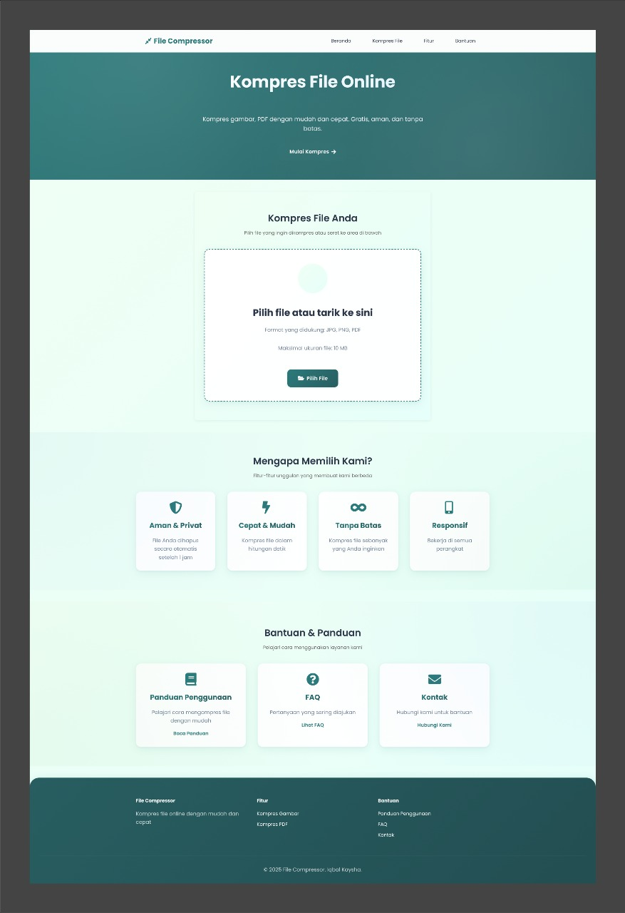
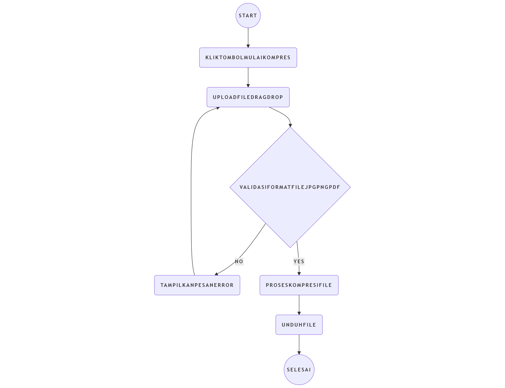

# 
File Compressor

Aplikasi web untuk kompresi file yang mudah digunakan dan modern. 
File Compressor memungkinkan Anda untuk mengompres berbagai jenis file seperti gambar (JPG, PNG, GIF), dan PDFdengan mudah.

## Tampilan UI

## Flowchart

## Fitur

- 🖼️ Kompresi gambar dengan berbagai opsi kualitas
- 🎯 Pengaturan ukuran maksimum file
- 🔄 Konversi format gambar (JPG, PNG, WebP)
- 📱 Antarmuka responsif dan modern
- 🖱️ Drag & drop file
- 📊 Preview file sebelum dan sesudah kompresi
- 📊 Informasi detail tentang hasil kompresi
- ⬇️ Unduh file terkompresi dengan mudah

## Teknologi yang Digunakan

- HTML5
- CSS3 (dengan variabel CSS dan Flexbox/Grid)
- JavaScript (ES6+)
- [Compressor.js](https://github.com/fengyuanchen/compressorjs) untuk kompresi gambar
- [Font Awesome](https://fontawesome.com/) untuk ikon

## Cara Menggunakan

1. Buka aplikasi di browser web
2. Pilih file yang ingin dikompres dengan cara:
   - Klik tombol "Pilih File"
   - Atau seret file ke area drop zone
3. Atur opsi kompresi sesuai kebutuhan:
   - Pilih kualitas kompresi (Tinggi, Menengah, Rendah)
   - Pilih format output (untuk gambar)
   - Atur ukuran maksimum file
4. Klik tombol "Kompres File"
5. Tunggu proses kompresi selesai
6. Lihat hasil kompresi dan informasi pengurangan ukuran
7. Unduh file terkompresi dengan mengklik tombol "Unduh File Terkompresi"

## Persyaratan Sistem

- Browser web modern (Chrome, Firefox, Safari, Edge)
- JavaScript diaktifkan
- Koneksi internet untuk mengunduh library yang diperlukan

## Pengembangan Lokal

1. Clone repositori ini
2. Buka file `index.html` di browser lokal
3. Atau gunakan server lokal seperti Live Server di VS Code

## Demo
[Demo]([URL](https://kayshallvy.github.io/web-compress-kaysha/))

## Kontribusi

Silakan buka issue atau pull request jika Anda ingin berkontribusi pada pengembangan aplikasi ini.

## Lisensi

MIT License - Lihat file [LICENSE](LICENSE) untuk detail lebih lanjut.

## Penulis

Dibuat oleh Iqbal dan Kaysha untuk memudahkan kompresi file sehari-hari. 
